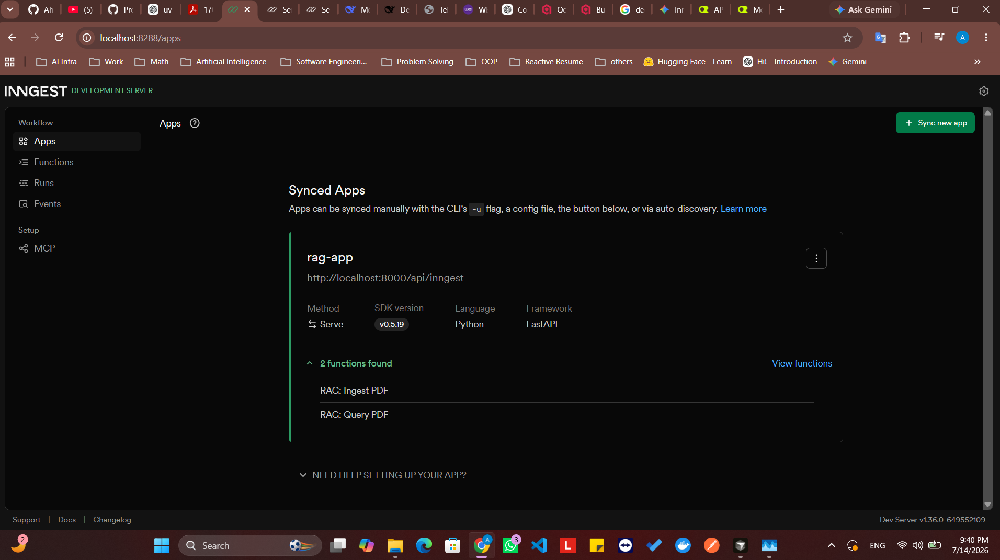
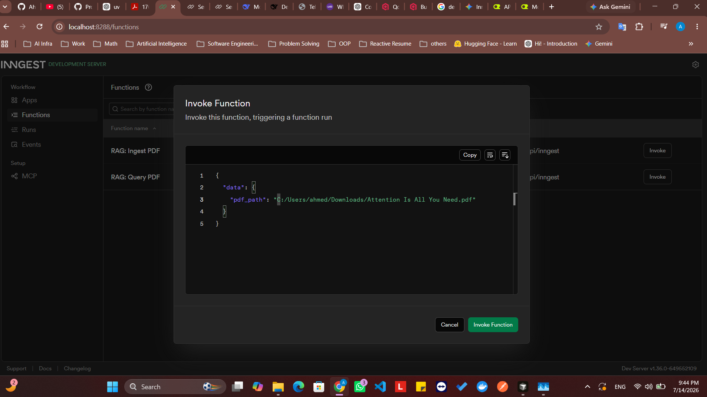
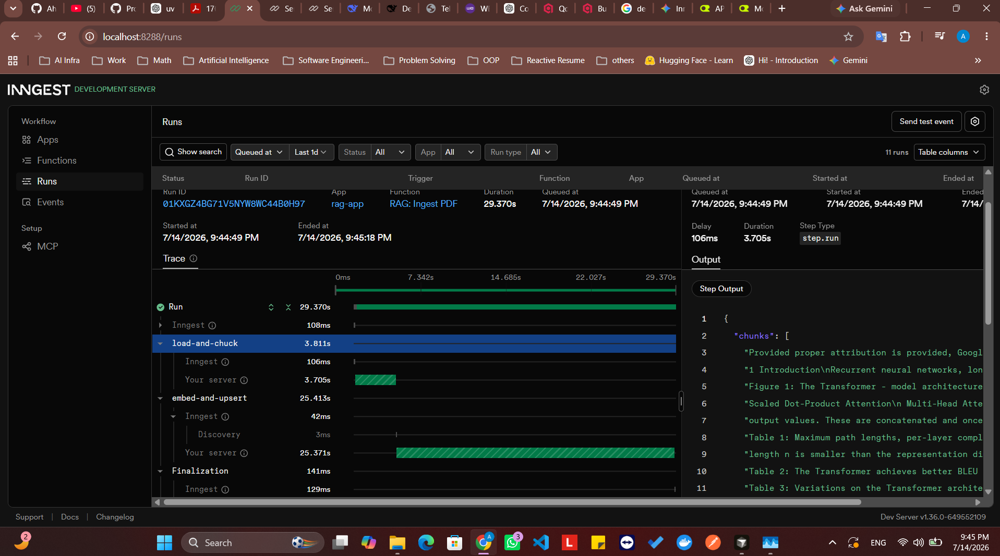
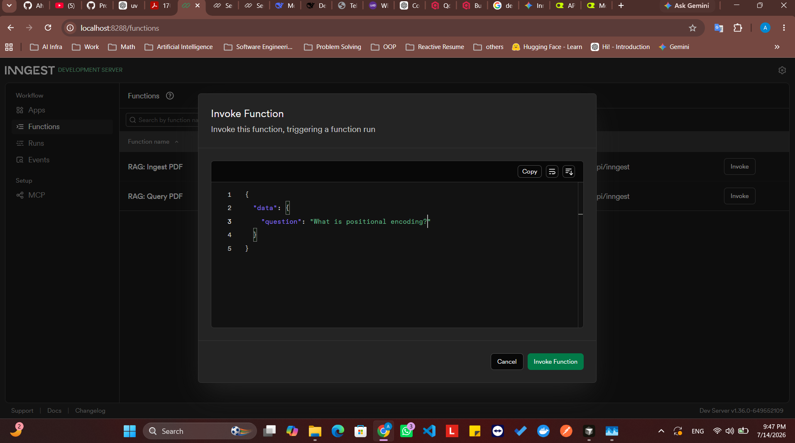
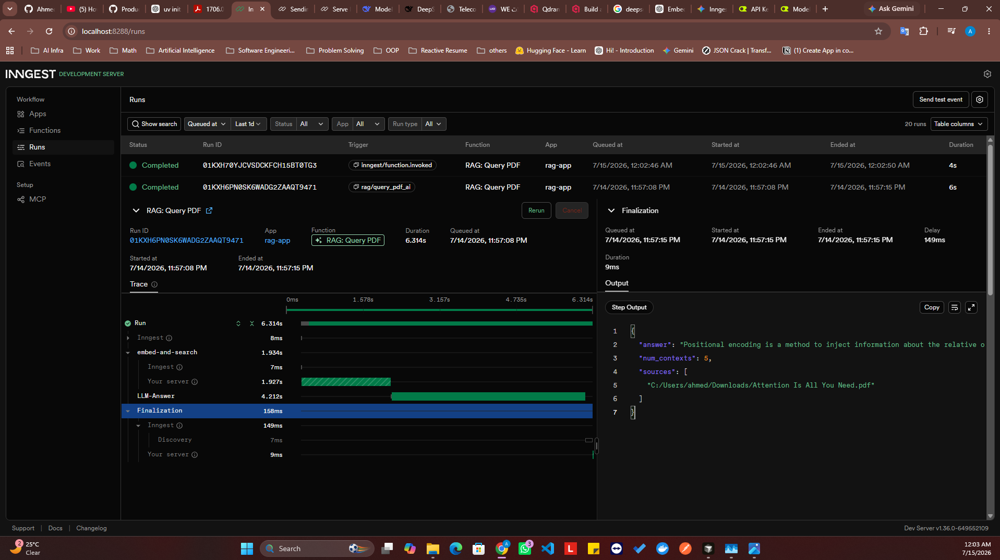
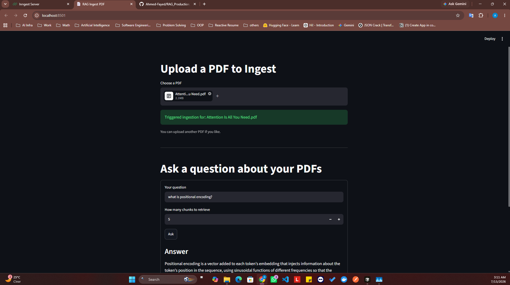

# RAG_Production_App

## Inngest Server




## Inngest Data

#### 1. Invoke the ingest function




#### 2. Run observability




## Query The Vector Database

#### 1. Invoke the query function




#### 2. Run observability




## Streamlit FrontEnd




# Prerequisities

### Install UV

```
winget install --id=astral-sh.uv -e
```

### Install NodeJS

```
winget install OpenJS.NodeJS.LT
```

# Run Qdrant DB

```
docker run -d --name qdrantRagDb -p 6333:6333 -v "$(pwd)/qdrant_storage:/qdrant/storage" qdrant/qdrant
```

# Run APP Server

```
uv run uvicorn main:app
```

# Run Streamlit Frontend
```
uv run streamlit run .\streamlite_app.py
```

# Run Inngest Server

```
npx inngest-cli@latest dev -u http://127.0.0.1:8000/api/inngest --no-discovery
```

# Check Qdrant Collections

```
curl http://localhost:6333/collections/docs
```